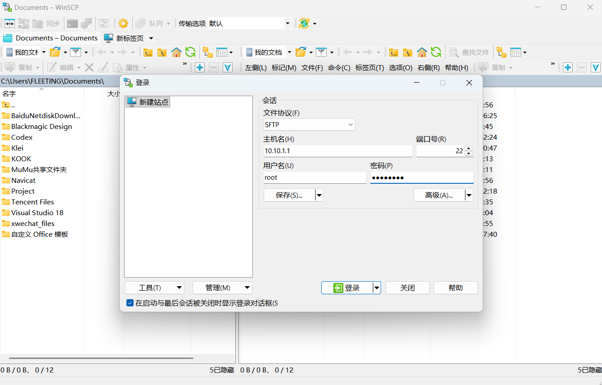
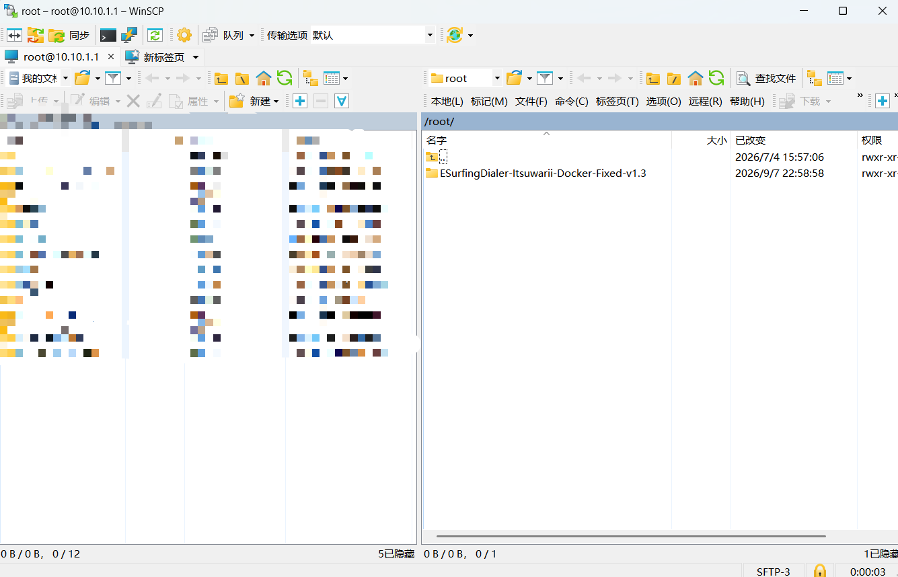
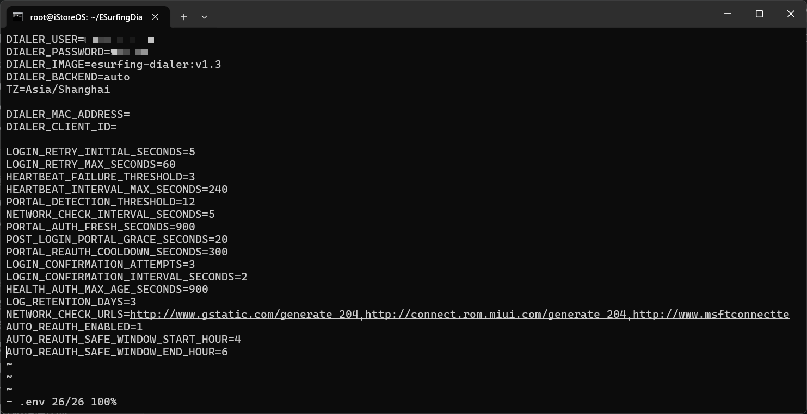
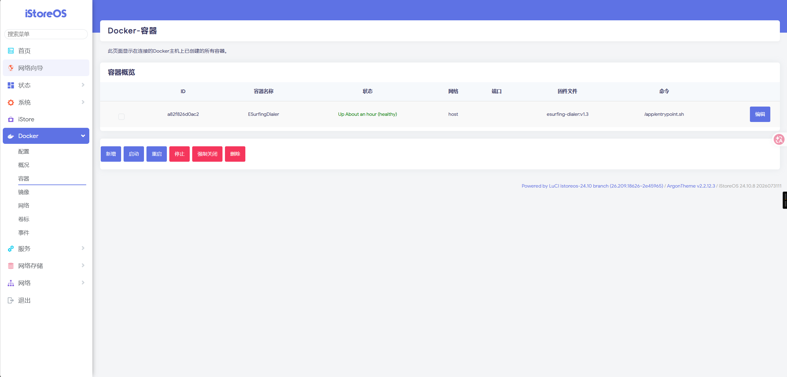

# ESurfingDialer Docker v1.3 离线部署教程

适用环境：已经安装 Docker 和 Docker Compose 的 OpenWrt / iStoreOS 软路由。

本教程只使用离线部署包。软路由不需要访问 Docker Hub、GitHub、Gradle 或 Maven；只需要在电脑上提前下载压缩包，再通过局域网上传到软路由。

## 第一步：安装 OpenWrt 或 iStoreOS

如果软路由还没有安装系统，请先参考下面的视频完成 OpenWrt / iStoreOS 的安装：

[OpenWrt / iStoreOS 安装教程（哔哩哔哩）](https://www.bilibili.com/video/BV1w541157Uo/)

完成系统安装后，请先确认软路由可以正常进入管理页面，并且已经安装 Docker 和 Docker Compose 插件，再继续下面的步骤。

## 第二步：使用 WinSCP 上传离线包

### 2.1 下载并打开 WinSCP

在电脑上下载并安装 WinSCP。打开后选择：

- 文件协议：`SFTP`
- 主机名：软路由的 IP 地址
- 端口号：`22`
- 用户名：`root`
- 密码：软路由的 root 密码



点击“登录”。第一次连接时如果出现主机密钥提示，确认 IP 地址无误后接受即可。

### 2.2 选择上传目录

登录成功后，右侧是软路由文件目录。WinSCP 默认通常会进入：

```text
/root
```



推荐直接使用 `/root` 目录：

1. 在电脑左侧找到下载好的 `ESurfingDialer-Itsuwarii-Docker-Fixed-v1.3.zip`。
2. 确认右侧当前目录是 `/root`。
3. 将压缩包直接拖到右侧窗口，等待上传完成。

也可以使用 `/mnt`、`/opt`，或自行创建目录，但新手更推荐 `/root`。`/mnt` 和 `/opt` 可能涉及挂载存储、权限或目录不存在等额外问题，容易导致后面的命令找不到文件。

上传完成后，右侧应能看到：

```text
/root/ESurfingDialer-Itsuwarii-Docker-Fixed-v1.3.zip
```

## 第三步：使用 Windows CMD 连接软路由终端

在 Windows 电脑上按 `Win + R`，输入：

```text
cmd
```

按回车打开命令提示符，然后输入下面的命令。请把 IP 地址替换成自己的软路由 IP：

```cmd
ssh root@10.10.1.1
```

第一次连接可能会询问是否信任主机，输入：

```text
yes
```

然后输入软路由 root 密码。输入密码时屏幕不会显示字符，这是正常现象，输入完成后直接按回车即可。

登录成功后，终端通常默认就在 `/root` 目录下。可以输入下面的命令确认当前目录：

```sh
pwd
```

如果显示 `/root`，说明已经在正确目录。此时再输入 `cd /root` 看起来没有变化也是正常的，因为当前本来就在 `/root`。

## 第四步：解压离线部署包

先确认压缩包存在：

```sh
ls -lh ESurfingDialer-Itsuwarii-Docker-Fixed-v1.3.zip
```

使用 `unzip` 解压：

```sh
unzip ESurfingDialer-Itsuwarii-Docker-Fixed-v1.3.zip
```

如果提示没有 `unzip` 命令，先在软路由的软件包管理页面安装 `unzip`。这只是在安装解压工具，不是下载 Docker 镜像。

进入解压后的目录：

```sh
cd /root/ESurfingDialer-Itsuwarii-Docker-Fixed-v1.3
ls -lh
```


## 第五步：离线安装并启动

给安装脚本增加执行权限：

```sh
chmod +x install.sh
```

运行一键离线安装：

```sh
sh install.sh
```

脚本会自动检查 Docker 和 Docker Compose、检测 CPU 架构、导入压缩包内的本地镜像、询问校园网账号密码、生成 `.env`、创建 `data` 目录并启动容器。

输入校园网密码时不会显示字符，输入完成后按回车即可。

## 如果准备使用网页界面启动

如果希望通过 Docker 网页管理界面启动容器，而不是让脚本直接启动，请使用下面的手动离线流程。

先导入压缩包内的本地镜像：

```sh
gzip -dc images/esurfing-dialer-v1.3-amd64.tar.gz | docker load
```

复制配置模板：

```sh
cp .env.example .env
vi .env
```

在 `.env` 中至少填写下面几项：

```dotenv
DIALER_USER=你的校园网账号
DIALER_PASSWORD=你的校园网密码
AUTO_REAUTH_ENABLED=1
AUTO_REAUTH_SAFE_WINDOW_START_HOUR=4
AUTO_REAUTH_SAFE_WINDOW_END_HOUR=6
```

下面是 `.env` 配置界面示例：



图片中的 `DIALER_USER` 和 `DIALER_PASSWORD` 分别填写校园网账号和密码。`DIALER_IMAGE` 请保留安装包中的 v1.3 配置，不要改成其他版本。

保存方法：按 `i` 开始编辑；完成后按 `Esc`，输入 `:wq`，再按回车。

配置完成后，只创建容器，不启动容器：

```sh
docker compose create --no-build --pull never
```

这个命令只创建容器，不会启动容器。接着打开软路由的 Docker 网页管理界面，找到 `ESurfingDialer`，点击“启动”。

在 iStoreOS 的 Docker 容器页面中，选中 `ESurfingDialer`，点击“启动”。启动成功后，状态一般会显示为运行中或 `healthy`：



第一次安装建议使用 `sh install.sh`。想通过网页界面启动时，再使用上面的手动流程。

## 常用检查命令

```sh
docker ps
docker logs --tail 120 ESurfingDialer
cat data/health.json
ls -lh data/logs
```

正常情况下日志中可以看到：

```text
LOGIN_SUCCESS
HEARTBEAT_SUCCESS
```

## 升级部署

升级时，重新按照本教程部署即可：

1. 在电脑上下载新的离线镜像包。
2. 使用 WinSCP 将新的压缩包上传到软路由的 `/root` 目录。
3. 使用 SSH 进入软路由，解压新的压缩包。
4. 进入新版本目录，重新执行离线安装或网页界面创建流程。

如果提示容器名称已经被使用，说明旧版 `ESurfingDialer` 容器还存在。请在 Docker 网页界面中选中旧容器，点击“停止”或“强制关闭”，再点击“删除”，然后回到新版本目录重新执行命令。

删除时只删除旧容器，不要删除 `data` 数据目录，也不要执行 `docker compose down -v` 或 `docker system prune -a`，避免误删数据。

v1.3 会根据历史认证时间预测下一次认证失效时间，并在安全时间段提前重新认证。相关开关如下：

```dotenv
AUTO_REAUTH_ENABLED=1
AUTO_REAUTH_SAFE_WINDOW_START_HOUR=4
AUTO_REAUTH_SAFE_WINDOW_END_HOUR=6
```

其中：

- `AUTO_REAUTH_ENABLED=1`：开启提前重新认证；改为 `0` 可关闭。
- `4` 和 `6` 表示安全时间段为每天 4:00 到 6:00。
- 即使关闭提前重新认证，掉认证后的自动恢复仍然保留。
